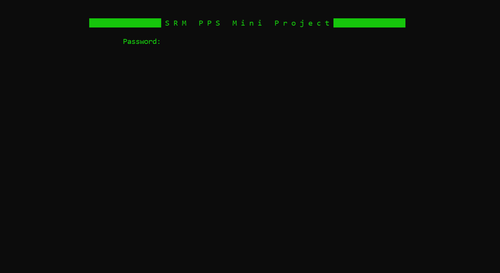

<h1> Programming For Problem Solving </h1>

***
# SECURE PHONEBOOK 📞 
> This project is made with C language. It is a Secure Phonebook which encrypts your contacts with a password. 

## Features 
>The Main menu of the PhoneBook Directory shows various options: 

> The Add new option adds a new contact

> The SEARCH option enables you to search from the existing contacts

 

 > The LIST option lists all the directory records 

  