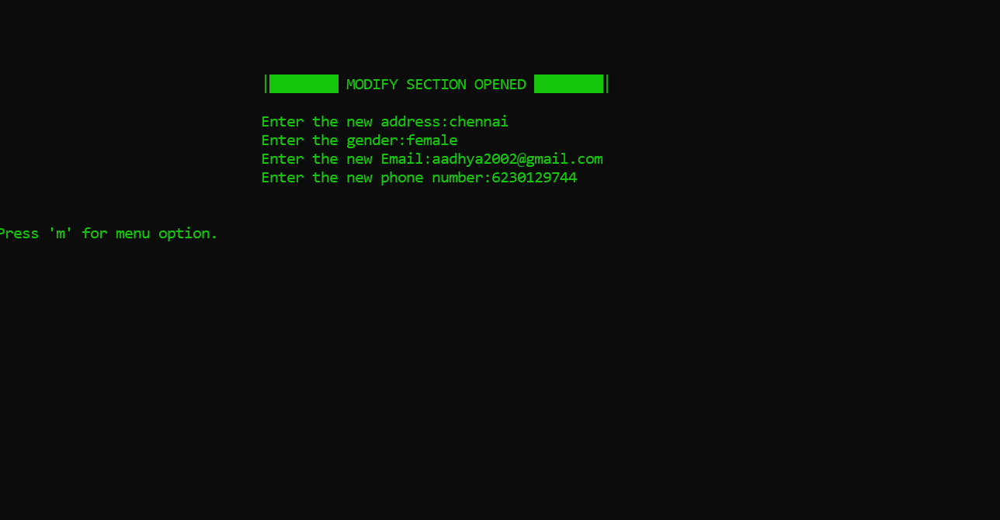
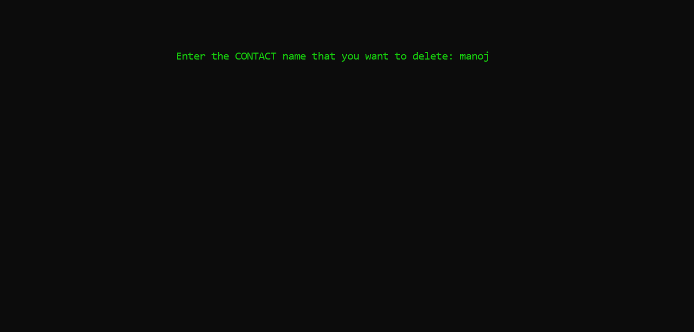

<h1> Programming For Problem Solving </h1>

***
# SECURE PHONEBOOK 📞 
> This project is made with C language. It is a Secure Phonebook which encrypts your contacts with a password. 

## Features 

  <table>
  <tr>
  <th> Feature </th>
  <th> Preview </th>
  <tr>
  <td> Main Menu </td>
  <td>  </td>
  </tr>
  <tr> 
  <td> Add New Contact </td>
  <td>  </td>
  </tr>
  <tr>
  <td> Search Contact </td>
  <td>  </td>
  </tr>
  <tr> 
  <td> List Contacts </td>
  <td>  </td>
  </tr>
  <tr> 
  <td> Modify Existing Contact </td>
  <td>  </td>
  </tr>
  <tr>
  <td> Delete Contact </td>
  <td>  </td>
  </tr>
  </table>

### Checkout the code here 📝
<https://github.com/aadhyamathur/pps_project/blob/37a1cefc6052f9af3c76969dea22429bd76d0965/main.c>

<h2>📬 Contact</h2>

If you want to contact me, you can reach me through below handle.

 <a href="https://www.linkedin.com/in/aadhya-mathur/">  Aadhya Mathur </img></a>
